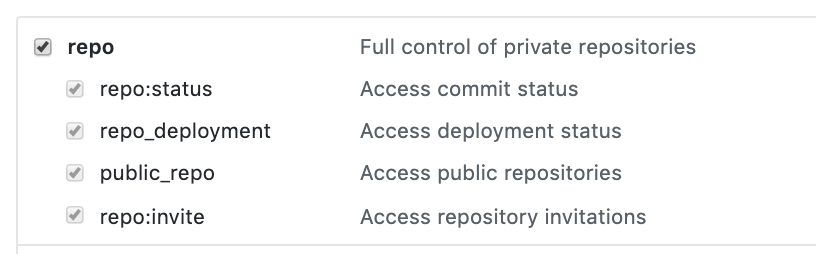

# gh-labels

Simple utility to copy labels from one GH repo to another


Works like this:

* Reads all the labels from the *source* repository
* **Deletes** all the labels in the *target* repository
* Clones one by one all the labels from *source* repository on the *target* repository

**IMPORTANT NOTICE**

Executing this program will wipe **all** labels in the target repository. I take no responsability on any side effects this program can cause to your github repository.

It is strongly suggested to execute on an empty repository to test how it works. Actually this is my use case: only on new repositories that have default GH labels.

Also, I have no idea how it would affect with GH issues which are using labels already. Onre more time: consider this program will wipe **all** your current labels, before copying the ones from the source repository.

I created this program because I am lazy, and it takes a while to copy/paste one by one (some repositories can have several labels).

## Installation

```
go get github.com/mauleyzaola/gh-labels
```

Program uses go modules, but should work on older golang versions. I only have tested it to work with `go1.3`

## Usage

`gh-labels` authenticates with GH Personal Token Access. Make sure you set `TOKEN` variable in your environment or when executing this program.

GH Token can be generated here: https://github.com/settings/tokens

Only these options are needed for this program to work



Example: Cloning the labels from https://github.com/facebook/react to https://github.com/mauleyzaola/garbage

```
TOKEN=708d25ca4ada98869528b6ab17933ca5c4c40dce gh-labels \
    -source facebook/react \
    -target mauleyzaola/garbage
```

Here is asciinema recording of the output: https://asciinema.org/a/9wsdKLCEoIZg0Pj4Y9iNZaCef

## TODO

* GH API apparently does not write the `description` field. Haven't figured it out yet.
* Get all the labels from repositories. Currently there is a limit of 30 items. Undocumented in the API afaik.
* Make this program more intelligent (don't wipe all, but just add the missing ones).
